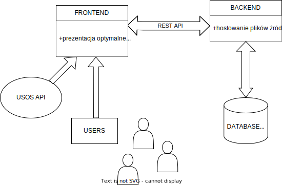

# Opis architektury

## Ogólna struktura
Aplikacja WWW składa się z frontendu napisanego w JavaScript'cie z użyciem frameworka Vue.js 3. Backend jest napisany w pythonie i opiera się na frameworku Django 4.2 wraz z bazą danych SQLite. Frontend komunikuje się z backendem tylko i wyłącznie za pomocą API. Aplikacja korzysta z API USOSa Uniwersystetu Warszawskiego do pobierania informacji o oferowanych przedmiotach i grupach zajęciowych. Informacje o popularności grup zapisywane są w bazie danych.

## Frontend
Aplikacja jest typu SPA. Udostępnia użytkownikowi UI pozwalające na wyszukiwanie przedmiotów, dodawanie ich oraz zaznaczenie, które grupy mają zostać wzięte pod uwagę w algorytmie proponującym plan. Przy każdym przedmiocie jest wyświetlana informacja o ilości osób, które w przeszłości spróbowały zoptymalizować plan zawierający tę grupę. Frontend również zajmuje się wysyłaniem zapytań do API USOSa oraz obliczaniem optymalnego planu wykorzystując moc obliczeniową komputera użytkownika.

Użyte biblioteki warte wymienienia to:
- vuetify - componentay UI
- vitest - testy jednostkowe
- pinia - przechowywanie stanu aplikacji
- coverage-c8 - raport code coverage

## Backend
Server udostępnia pliki źródłowe skompilowanej i skompresowanej strony WWW, panel administratora oraz komunikuje się z frontendem w celu aktualizowania statystyk, w UI na stronie oraz w bazie danych, poprzez API.

### CI / CD
Aplikacja jest postawiona na hostingu Heroku z wykorzystaniem serwera produkcyjnego gunicorn. Heroku również odpowiada za Continuous Delivery. Github Actions odpowiada Continuous Integration wraz z Codecov.io.

## Diagram UML

  

